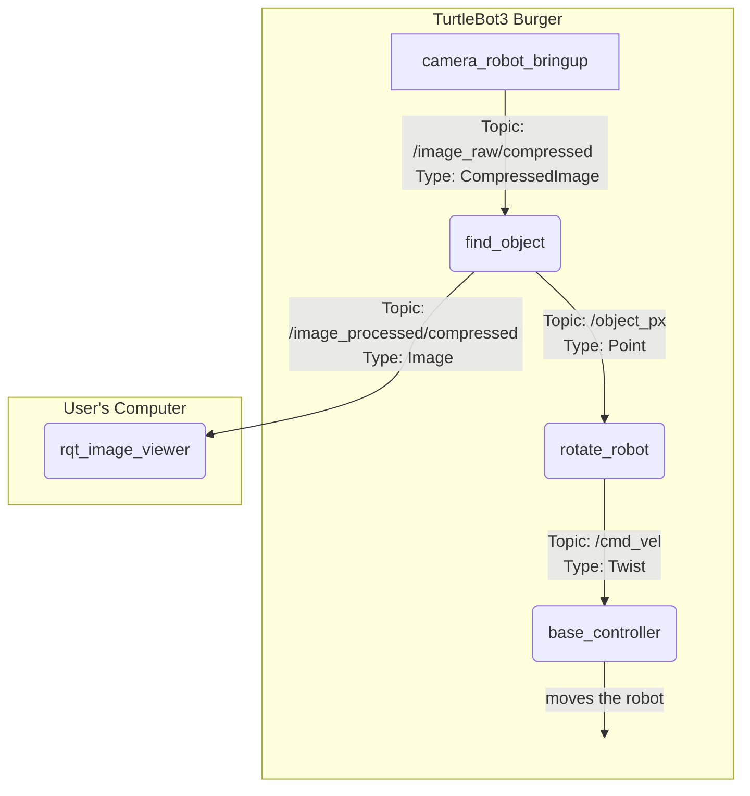

# ROS 2 Object Follower for TurtleBot 3

  

## Overview

  

This ROS 2 project enables a TurtleBot 3 Burger robot to perform real-time object tracking. It uses the onboard Raspberry Pi camera to detect a colored object (configured for red by default) and turns in place to keep the object centered in its field of view. The system also publishes a debug video stream with visual overlays for remote monitoring.

  

This package was developed as part of the CS/ME/ECE/AE/BME 7785 course at Georgia Tech.

  

***

  

## ROS Computation Graph

  

The system consists of two primary nodes running on the robot (`find_object` and `rotate_robot`) and an optional visualization tool (`rqt_image_view`) running on a remote computer. The data flow is illustrated below.

  



  

***

  

## Dependencies

  

Before building, ensure you have the following installed:

  

*  **ROS 2 Humble:** The core robotics framework.

*  **TurtleBot3 Packages:** Specifically, the `turtlebot3_bringup` package is required.

*  **RQT Image View:** For visualization on the remote computer.

```bash

sudo apt-get install ros-humble-rqt-image-view

```

*  **Image Transport Plugins:** Required to view compressed image topics.

```bash

sudo apt-get install ros-humble-image-transport-plugins

```

  

***

  

## Setup and Build

  

1.  **Navigate to your Git directory:**

```bash

cd ~/autobots/

```

  

2.  **Clone the repository (if needed):**

```bash

# git clone <your-repository-url> .

```

  

3.  **Navigate to the workspace and build:**

```bash

cd ~/autobots/lab2_ws/

colcon build

```

  

***

  

## Usage

  

The system is designed to run across two machines: the robot and a remote computer (VM) on the same network.

  

**Important:** In every new terminal on both machines, you must set the `ROS_DOMAIN_ID`.

  

```bash

export  ROS_DOMAIN_ID=76

```

  

#### On the TurtleBot 3 Robot

  

This single command starts the robot's hardware drivers, camera, and the object detection and rotation nodes.

  

1.  **Source the workspace:**

```bash

source ~/autobots/lab2_ws/install/setup.bash

```

2.  **Run the master launch file:**

```bash

ros2 launch autobots_object_follower autobots_master.launch.py

```

  

#### On the Remote Computer (VM)

  

These commands allow you to visualize the robot's debug video feed.

  

1.  **Source the ROS 2 environment:**

```bash

source /opt/ros/humble/setup.bash

```

  

2.  **Run the RQT Image Viewer:**

```bash

rqt_image_view

```

  

3. In the GUI window that appears, select the `/image_processed/compressed` topic from the dropdown menu.

  

***

  

## Configuration

  

All key parameters can be easily tuned by editing the `constants.py` file located at:

  

`~/autobots/lab2_ws/src/autobots_object_follower/autobots_object_follower/constants.py`

  

Key tunable parameters include:

  

*  **HSV Color Thresholds:**  `H_LOW`, `S_LOW`, `V_LOW`, etc., define the color of the object to be tracked.

*  **Object Size Filter:**  `MIN_AREA_RATIO` and `MAX_AREA_RATIO` prevent the robot from tracking objects that are too small or too large.

*  **Robot Turn Speed:**  `TURN_SPEED` controls how quickly the robot rotates to follow the object.

*  **ROS Topic Names:** All topic names are centralized here for easy management.

  

After modifying the `constants.py` file, you do not need to rebuild the workspace. Simply stop and restart the launch file.