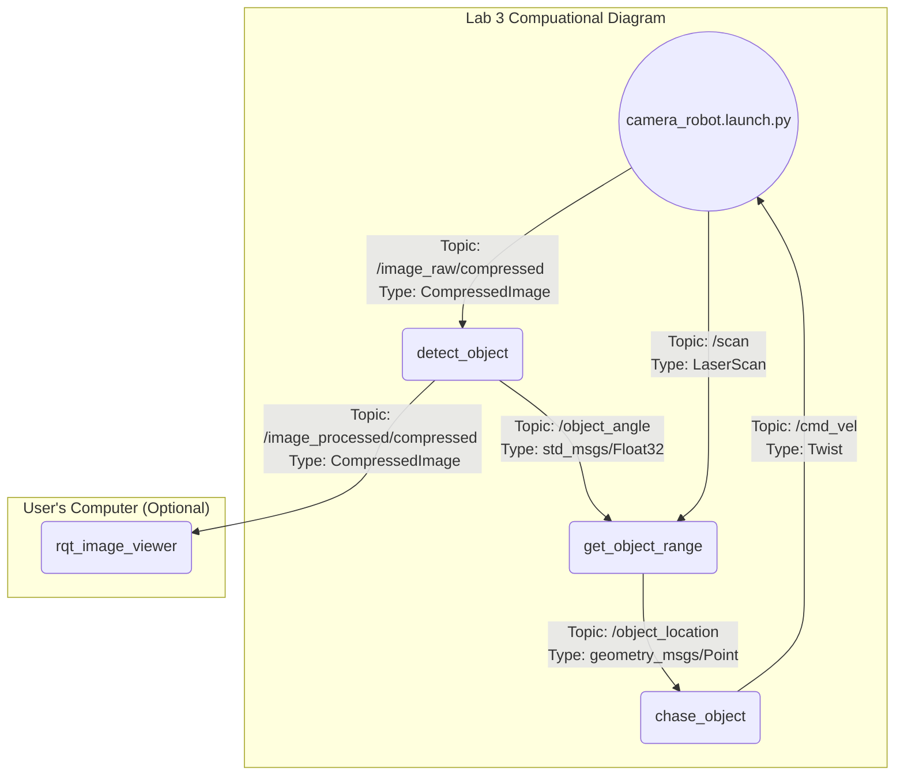

```mermaid

graph TD
    subgraph "Lab 3 Compuational Diagram"
        Drivers((camera_robot.launch.py)) -->|"Topic: /image_raw/compressed <br> Type: CompressedImage"| B(detect_object);
        B -->|"Topic: /object_angle <br> Type: std_msgs/Float32"| C;
        Drivers -->|"Topic: /scan <br> Type: LaserScan"| C(get_object_range);
        C -->|"Topic: /object_location <br> Type: geometry_msgs/Point"| D(chase_object);
        D -->|"Topic: /cmd_vel <br> Type: Twist"| Drivers;
    end

    subgraph "User's Computer (Optional)"
        G(rqt_image_viewer);
    end

    B -->|"Topic: /image_processed/compressed <br> Type: CompressedImage"| G;

```