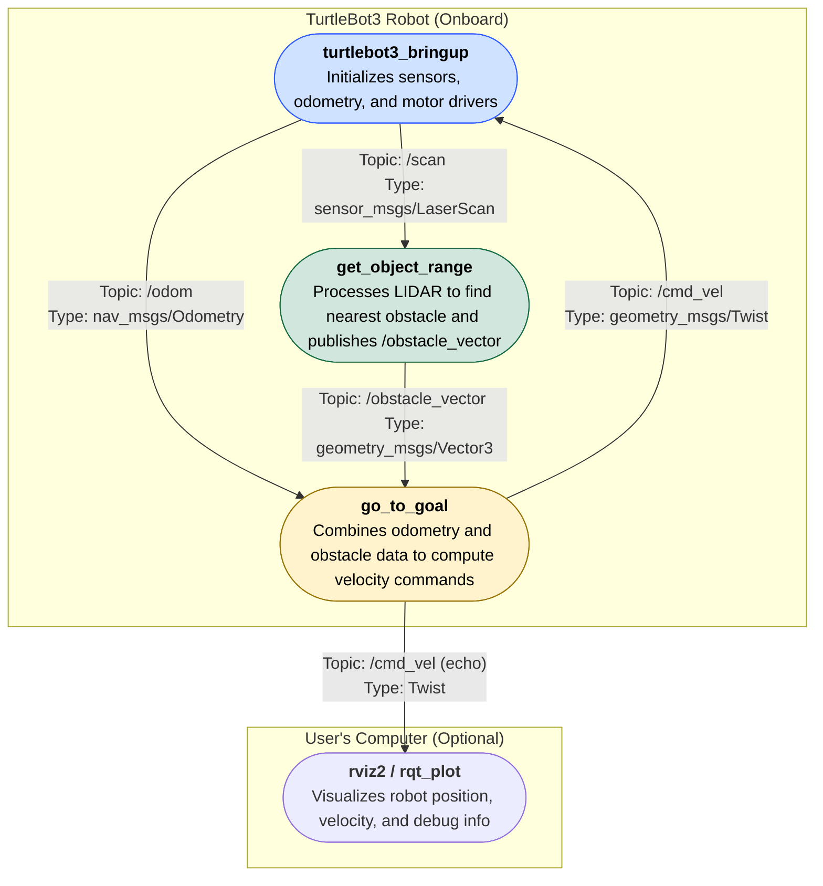

```mermaid
graph TD
    subgraph "TurtleBot3 Robot (Onboard)"
        A(["<b>turtlebot3_bringup</b><br>Initializes sensors, odometry, and motor drivers"]):::bringup -->|"Topic: /scan <br> Type: sensor_msgs/LaserScan"| B(["<b>get_object_range</b><br>Processes LIDAR to find nearest obstacle and publishes /obstacle_vector"]);
        A -->|"Topic: /odom <br> Type: nav_msgs/Odometry"| C(["<b>go_to_goal</b><br>Combines odometry and obstacle data to compute velocity commands"]);
        B -->|"Topic: /obstacle_vector <br> Type: geometry_msgs/Vector3"| C;
        C -->|"Topic: /cmd_vel <br> Type: geometry_msgs/Twist"| A;
    end

    subgraph "User's Computer (Optional)"
        V(["<b>rviz2 / rqt_plot</b><br>Visualizes robot position, velocity, and debug info"]);
    end

    C -->|"Topic: /cmd_vel (echo) <br> Type: Twist"| V;

    %% Node styling
    classDef bringup fill:#CFE2FF,stroke:#2F5CFF,color:#000,stroke-width:1px;
    classDef range fill:#D1E7DD,stroke:#146C43,color:#000,stroke-width:1px;
    classDef goal fill:#FFF3CD,stroke:#997404,color:#000,stroke-width:1px;

    %% Apply styles
    class A bringup;
    class B range;
    class C goal;

```